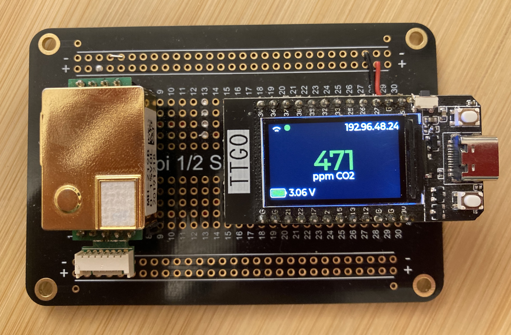
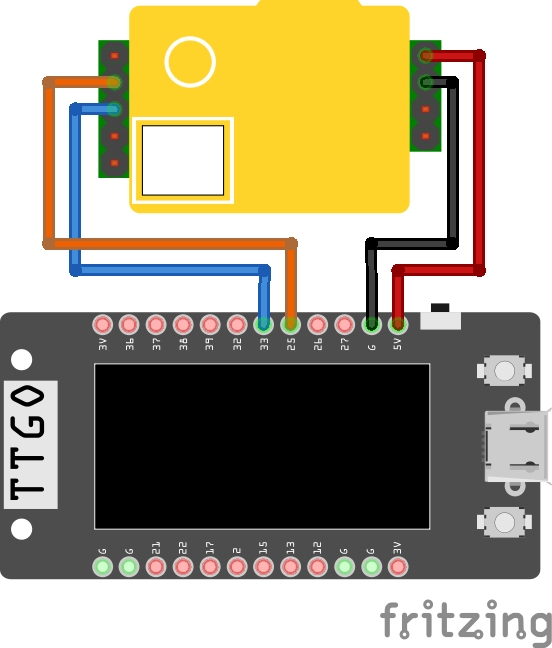

<!--
*** raulgotor, co2monitor, twitter_handle, TTGO ESP32 CO2 Monitor, CO2 Monitor based on the MH-Z19B Infrared CO2 sensor running on a ESP32 TTGO Display V1.1
-->


<!-- PROJECT SHIELDS -->
<!--
-->
[![Contributors][contributors-shield]][contributors-url]
[![Forks][forks-shield]][forks-url]
[![Stargazers][stars-shield]][stars-url]
[![Issues][issues-shield]][issues-url]
[![MIT License][license-shield]][license-url]

<!-- PROJECT LOGO -->
<br />
<p align="center">
  <a href="https://github.com/raulgotor/co2monitor">
    <!img src="images/logo.png" alt="Logo" width="80" height="80">
  </a>

<h3 align="center">TTGO ESP32 CO2 Monitor</h3>

  <p align="center">
    CO2 Monitor based on the MH-Z19B Infrared CO2 sensor running on a ESP32 TTGO Display V1.1
    <br />
    <a href="https://github.com/raulgotor/co2monitor"><strong>Explore the docs »</strong></a>
    <br />
    <br />
    <a href="https://github.com/raulgotor/co2monitor">View Demo</a>
    ·
    <a href="https://github.com/raulgotor/co2monitor/issues">Report Bug</a>
    ·
    <a href="https://github.com/raulgotor/co2monitor/issues">Request Feature</a>
  </p>

<!-- TABLE OF CONTENTS -->
<details open="open">
  <summary><h2 style="display: inline-block">Table of Contents</h2></summary>
  <ol>
    <li>
      <a href="#getting-started">Getting Started</a>
      <ul>
        <li><a href="#prerequisites">Prerequisites</a></li>
        <li><a href="#installation">Installation</a></li>
      </ul>
    </li>
    <li><a href="#usage">Usage</a></li>
    <li><a href="#roadmap">Roadmap</a></li>
    <li><a href="#contributing">Contributing</a></li>
    <li><a href="#license">License</a></li>
    <li><a href="#contact">Contact</a></li>
    <li><a href="#acknowledgements">Acknowledgements</a></li>
  </ol>
</details>


<!-- ABOUT THE PROJECT -->
## About The Project



Here you get a wireless battery powered CO2 monitor device with color display and internet connectivity.
It is based on the very well known MH-Z19B sensor, and on a ESP32 TTGO Display board, which 
integrates a display and two control push buttons, therefore facilitating build from readily
available components. As the device is battery powered, it is very handy to perform on-field measurements.
The information is sent to a specified Thingsboard.io server for further plotting.

Basic features are:

- WiFi enabled CO2 monitor
- MH-Z19B CO2 Sensor: 400 - 10000 ppm CO2 range
- Display (IPS ST7789V 1.14 Inch) controlled by LVGL library v6.0
- Battery operated
- Display shows actual CO2 concentration as well as wifi and backend status and battery level
- Automatic display power-off
- Thingsboard.io integration
- WiFi manager handling reconnection and AP configuration

### Built With

* ESP-IDF v4.4-dev-3042-g220590d599

<!-- GETTING STARTED -->
## Getting Started

### Set-up

This repository is meant to be run in a ESP32 TTGO Display V1.1, but can be ran on any compatible
ESP32 module connected to an external display according to TTGO module schematics. The default connection of the sensor
with the TTGO board is as follows:

| MH-Z19 | TTGO GPIO |
|--------|-----------|
|    Vin |        5V |
|    GND |       GND |
|     Rx |        25 |
|     Tx |        33 |



### Installation

#### Prerequisites

- Install ESP-IDF Framework, follow the walk-through [here](https://docs.espressif.com/projects/esp-idf/en/latest/esp32/get-started/linux-macos-setup.html).

#### Steps

1. Clone the repo
   ```sh
   git clone https://github.com/raulgotor/co2monitor.git
   ```
   
2. cd into the repo folder and build the firmware:
   ```sh
   cd co2monitor && idf.py build
   ```
   
3. Flash the firmware into the hardware:
   ```sh
   idf.py flash
   ```

<!-- USAGE EXAMPLES -->
## Usage

After booting, the device will start sampling CO2 concentration and showing the result at the display. Additionally, it
will connect to the configured WiFi network and each measurement will be sent to the specified Thingsboard.io server.

### Configuring WiFi credentials

If a configured network is not available, the device will launch an access point named __CO2_Monitor__. Connect to that
network and a captive portal will pop-up (if it doesn't, manually navigate to address ...... in your browser).

Configure it with your network credentials and press __Join__. If everything went well, you'll see your network SSID on the
device display, together with the signal strength.

A small pilot next to the signal strength indicator shows the backend connectivity status: green or red depending if it
was able to post messages to the backend.

### Configuring Thingsboard server and token

### Turning the display on and off

The display can be turned on and off by pressing the bottom-right button at the TTGO board. Additionally, the display
will turn off automatically after a specific amount of time which can be configured at the firmware configuration menu.

Launch the configuration menu with `idf.py menuconfig` and navigate to `Component config -> Application configuration -> Backlight automatic turn off` and select the desired
timeout (in seconds). To disable automatic turn off, configure it to 0 seconds.

### Calibrating CO2 sensor

Place the device outdoors (the CO2 concentration outdoors is around 410ppm at the atmosphere), and after 15 minutes,
press the bottom-left button on the TTGO board. The device will calibrate itself and take the current measured concentration
as 400 ppm.

__NOTE__: don't press the calibration button indoors as it will wrongly calibrate the device.
 
### Further documentation


<!-- ROADMAP -->
## Roadmap

See the [open issues](https://github.com/raulgotor/co2monitor/issues) for a list of proposed features (and known issues).


<!-- CONTRIBUTING -->
## Contributing

1. Fork the Project
2. Create your Feature Branch (`git checkout -b feature/AmazingFeature`)
3. Commit your Changes (`git commit -m 'Add some AmazingFeature'`)
4. Push to the Branch (`git push origin feature/AmazingFeature`)
5. Open a Pull Request


<!-- LICENSE -->
## License

Distributed under the MIT License. See `LICENSE` for more information.

<!-- CONTACT -->
## Contact

Raúl Gotor

Project Link: [https://github.com/raulgotor/co2monitor](https://github.com/raulgotor/co2monitor)

<!-- ACKNOWLEDGEMENTS -->
## Acknowledgements

* [LVGL - Light and Versatile Graphics Library](https://lvgl.io)
* [esp32-wifi-manager](https://github.com/tonyp7/esp32-wifi-manager)
* [Embedded C Coding Standard, 2018 Michael Barr](https://barrgroup.com/sites/default/files/barr_c_coding_standard_2018.pdf)
* [Best README template](https://github.com/othneildrew/Best-README-Template)


<!-- MARKDOWN LINKS & IMAGES -->
<!-- https://www.markdownguide.org/basic-syntax/#reference-style-links -->
[contributors-shield]: https://img.shields.io/github/contributors/raulgotor/co2monitor.svg?style=for-the-badge
[contributors-url]: https://github.com/raulgotor/co2monitor/graphs/contributors
[forks-shield]: https://img.shields.io/github/forks/raulgotor/co2monitor.svg?style=for-the-badge
[forks-url]: https://github.com/raulgotor/co2monitor/network/members
[stars-shield]: https://img.shields.io/github/stars/raulgotor/co2monitor.svg?style=for-the-badge
[stars-url]: https://github.com/raulgotor/co2monitor/stargazers
[issues-shield]: https://img.shields.io/github/issues/raulgotor/co2monitor.svg?style=for-the-badge
[issues-url]: https://github.com/raulgotor/co2monitor/issues
[license-shield]: https://img.shields.io/github/license/raulgotor/co2monitor.svg?style=for-the-badge
[license-url]: https://github.com/raulgotor/co2monitor/blob/master/LICENSE.txt
[linkedin-shield]: https://img.shields.io/badge/-LinkedIn-black.svg?style=for-the-badge&logo=linkedin&colorB=555
[linkedin-url]: https://linkedin.com/in/raulgotor